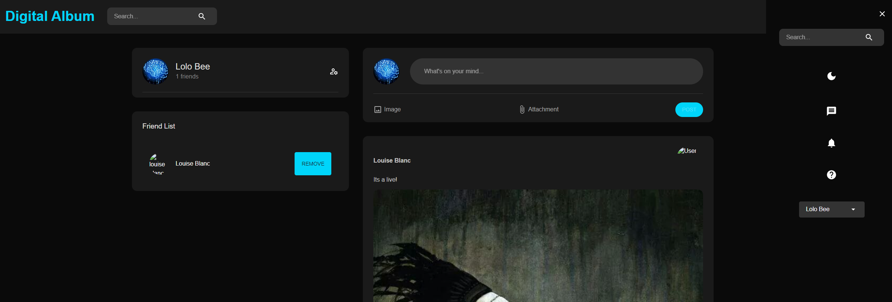
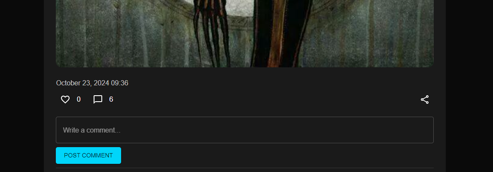
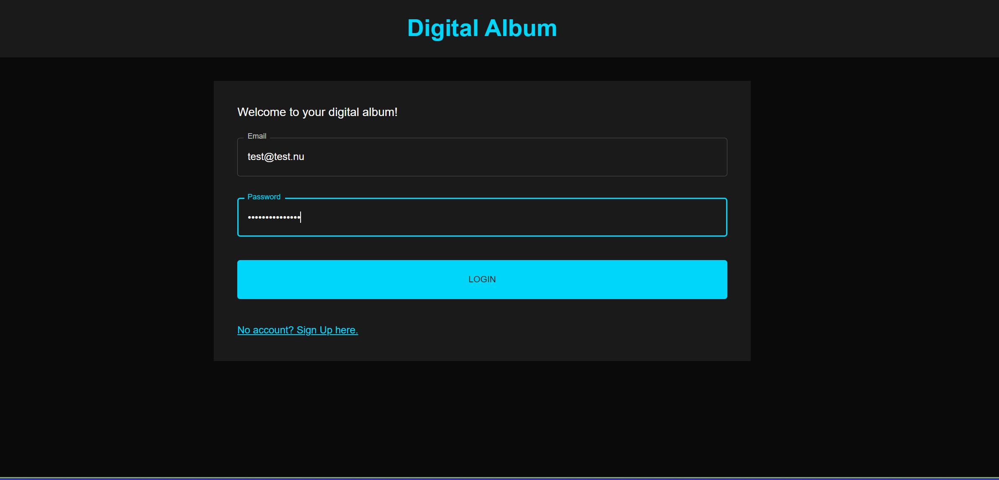

# MERN Fullstack Photo App

## Description:

This is a fullstack app that uses nodejs for backend and reactjs for fronted and mongoDB as database.

It's a social media app where you can create an account too connect with friends and family too both share and view photos.

## Work process

[Setup intructions](x-ReadME/process.md)

- ESLint _for linting_
- Airbnb _as standard_
- Prettier _for formatting_
- PWA
- Postman documentation

## Deploy

#### Backend

- Render: https://u09-photo-app-fullstack-lolliten.onrender.com

#### Frontend: https://deploy-preview-45--digitalalbum.netlify.app/

- Netlify

## Links

### The Process

- [Read about setup, develop and installation here](x-ReadME/DevelopProcess.md)

#### Figma

- [Look at prototypes, sitemap and ER-diagram here](https://www.figma.com/proto/OFMJ1vpfDmxRJnfXUxQg3z/Figma-Project?node-id=0-1&t=u4XbcaaR8QwriqHr-1)

#### User stories and questionaire:

- [Read UserStories and Questionnaire here](x-ReadME/User_and_links.md)

### Screenshots

